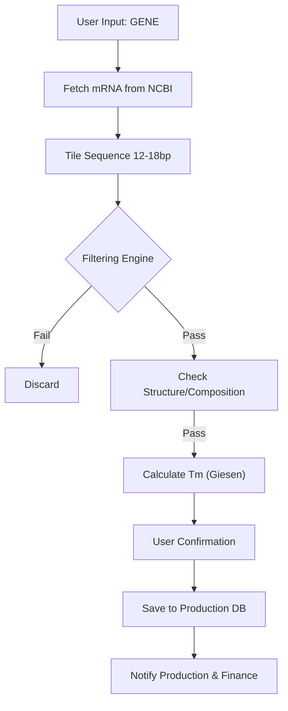

# PNA Oligo Production & Design System

A comprehensive automated system for designing Peptide Nucleic Acid (PNA) probes for *In Situ* Hybridization (ISH). This system combines rigorous biophysical algorithms with a modern automated workflow for sequence acquisition, design, and production processing.

## 🚀 Features
*   **Automated Design Engine**: Generates and tiles probes against target mRNA.
*   **NCBI Integration**: Automatically fetches canonical mRNA sequences using Gene Symbols.
*   **Scientific Validation**: Implements the **Giesen Formula** for PNA/DNA $T_m$ and strict solubility filters.
*   **Web Interface**: Interactive Streamlit app for real-time design and visualization.
*   **Production Workflow**: Automation triggers for synthesis ordering and financial processing.

---

## 🏗️ System Architecture

The system follows a linear pipeline from gene identification to order fulfillment:

### 1. Sequence Acquisition
*   **Input**: User provides a Gene Symbol (e.g., "GAPDH") or raw sequence.
*   **Fetch**: The system queries NCBI GenBank (RefSeq) to retrieve the canonical mRNA transcript.

### 2. Design & Filtering Engine
The engine processes the target sequence through multiple filtration layers:
*   **Tiling**: Generates 15-mer (default) candidate probes.
*   **Biophysical Checks**:
    *   **GC Content**: $30\% \le GC \le 70\%$
    *   **Purine Content**: $< 60\%$ (Max 6 in any 10bp window)
    *   **G-Runs**: Max 3 consecutive Gs (to prevent G-quadruplexes)
    *   **Structure**: Checks for self-complementarity ($>4$ bp)
*   **Thermodynamics**: Calculates $T_m$ using the **Giesen Formula**.

### 3. Order Processing
*   **Production**: Generates synthesis orders with required modifications (O-linkers, Lysine tags).
*   **Finance**: Triggers invoice generation workflows.



---

## 🧬 Scientific Principles

PNA probes offer exceptional binding affinity and mismatch discrimination but require specialized design constraints distinct from DNA probes.

### Thermodynamic Model (Giesen Formula)
The system predicts the Melting Temperature ($T_m$) of PNA/DNA duplexes using the empirical model from *Giesen et al. (1998)*:

$$T_{m,PNA} = 20.79 + 0.83 \cdot T_{m,DNA} + 0.44 \cdot L - 26.13 \cdot f_{pyr}$$

*   $T_{m,DNA}$: Calculated using Nearest-Neighbor thermodynamics (SantaLucia parameters).
*   $f_{pyr}$: Fraction of pyrimidines in the PNA strand.
*   $L$: Length of the probe.

### Key Constraints
| Parameter | Range | Rationale |
| :--- | :--- | :--- |
| **Length** | 12–18 bp | Optimal balance of specificity and cell penetration. |
| **Purine Content** | < 60% | High purine probes aggregate and are insoluble. |
| **Target $T_m$** | 30°C – 60°C | Tunable range for specific experimental conditions. |

---

## 💻 Installation & Usage

### 1. Setup
Install Python 3.9+ and the required dependencies:
```bash
pip install -r requirements.txt
```

### 2. Web Interface (Recommended)
Launch the interactive dashboard:
```bash
streamlit run app.py
```
This opens a local web server where you can search for genes, adjust parameters, and download results.

### 3. Command Line Interface (CLI)
Run the pipeline directly from the terminal:
```bash
# By Gene Symbol
python -m src.main --gene "GAPDH"

# By Raw Sequence
python -m src.main --sequence "ATGC..." --gene "CustomGene"
```

---

## ☁️ Deployment

The app is optimized for deployment on **Streamlit Community Cloud**.

### Steps to Deploy
1.  **Push to GitHub**:
    ```bash
    git init
    git add .
    git commit -m "Initial commit"
    git push -u origin main
    ```
2.  **Deploy**:
    *   Go to [share.streamlit.io](https://share.streamlit.io/).
    *   Select your repository.
    *   Set the **Main file path** to `app.py`.
    *   Click **Deploy**.

---

## 📂 Project Structure
*   `src/`: Core source code.
    *   `designer.py`: Tiling and orchestration logic.
    *   `thermo.py`: Thermodynamic calculations.
    *   `filters.py`: Biophysical validation rules.
    *   `ncbi.py`: Entrez API integration.
    *   `config.py`: Global configuration and constants.
*   `app.py`: Streamlit web application.
*   `pna_results.csv`: Output of the latest analysis.
