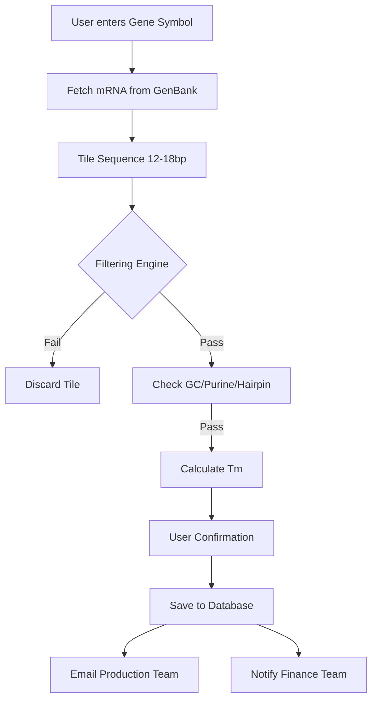

# PNA Oligo Ordering & Automation System

This document outlines the functional requirements and automated workflow for the PNA designer system, from gene identification to production notification.

---

## 1. Sequence Acquisition
1.  **Search Interface:** User enters a standard **Gene Symbol**.
2.  **Database Integration:** The system queries GenBank to retrieve the **canonical mRNA sequence**.
3.  **Feature Extraction:** Extract exon boundaries and junction information to allow for junction-spanning probe design if requested.

---

## 2. Probe Design & Filtering
The system automatically generates and filters candidate PNA tiles based on defined biophysical constraints.

1.  **Tiling:** Generate sequence tiles of the user-specified length (default: 15-mer).
2.  **Composition Check:**
    *   **GC Content:** Filter for $30\% \le GC \le 70\%$.
    *   **Purine Content:** Filter for Purines $< 60\%$.
3.  **Stability Analysis:**
    *   **Self-Complementarity:** Filter out tiles with self-complementary regions $>4$ bp.
    *   **Hairpin Formation:** Run secondary structure prediction; discard tiles with significant hairpin stability.
4.  **Thermodynamic Modeling:**
    *   Calculate the predicted **DNA melting temperature** ($T_m$) for each tile as a reference point for PNA conversion.

---

## 3. Order Processing & Fulfillment
Once the optimal tiles are selected and confirmed by the user, the system triggers the following automation:

| Step | Action | Recipient |
| :--- | :--- | :--- |
| **Data Persistence** | Save final probe sequences, target gene metadata, and design parameters to the **Production Database**. | System DB |
| **Production Alert** | Generate and send a synthesis order email containing the sequence and required modifications (tags/linkers). | Production Team |
| **Financial Workflow** | Send a notification to the **Finance Department** to generate an invoice/bill for the order. | Finance Team |

---

## 4. Technical Workflow Diagram

